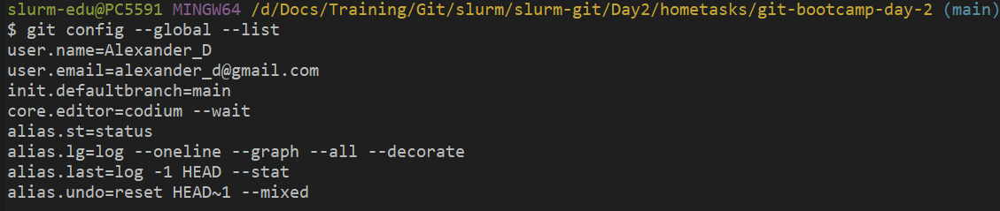
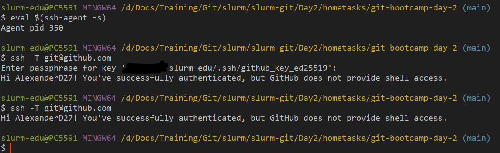
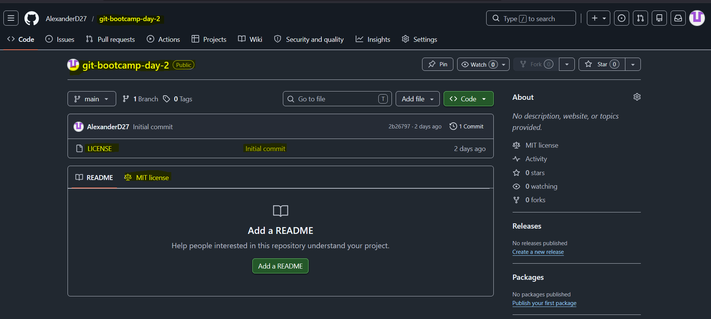
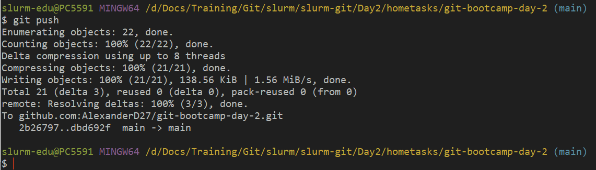
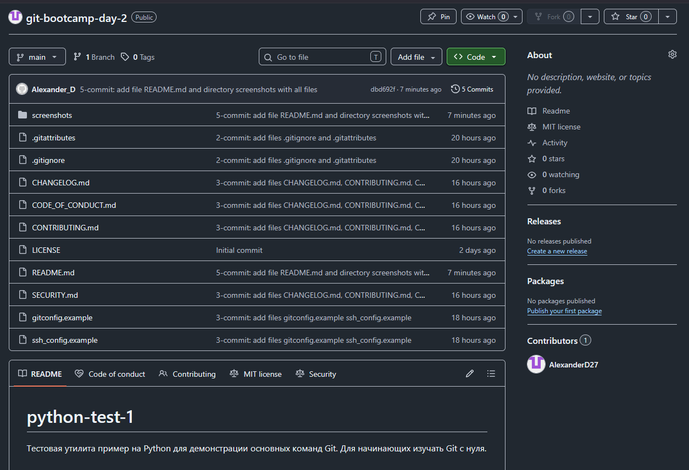

<!--
Шаблон отчёта по ДЗ дня 2.
Скопируйте этот файл в корень своего репозитория `git-bootcamp-day-2` под именем `LAB.md` и заполните.
Удалите этот HTML-комментарий перед коммитом.
Места `<...>` — заменяйте на свои значения. Места `[FIXME: ...]` — это подсказки, что написать.
-->

# LAB — день 2

Отчёт о выполнении домашнего задания дня 2 в рамках курса ["Интенсив по погружению в GIT"](https://slurm.io/git-intensive): настройка `gitconfig` и SSH, создание публичного репозитория, наполнение его служебными и стандартными файлами.

## Содержание

- [LAB — день 2](#lab--день-2)
  - [Содержание](#содержание)
  - [Настройка gitconfig](#настройка-gitconfig)
  - [SSH-ключ и подключение к GitHub](#ssh-ключ-и-подключение-к-github)
  - [Создание репозитория](#создание-репозитория)
  - [Служебные файлы](#служебные-файлы)
    - [`.gitignore`](#gitignore)
    - [`.gitattributes`](#gitattributes)
  - [Стандартные файлы и выбор лицензии](#стандартные-файлы-и-выбор-лицензии)
    - [Почему именно эта лицензия](#почему-именно-эта-лицензия)
  - [Markdown](#markdown)
  - [Финальный пуш](#финальный-пуш)

## Настройка gitconfig

Заданы параметры в уровне global: 

- user.name "Имя Фамилия" - (автор к коммитах)
- user.email "your@email.com" - (e-mail автора в коммитах)
- init.defaultBranch main - (имя ветки по умолчанию)
- core.editor "codium --wait" - установка редактора по умолчанию;
- алиасы: st, lg, last, undo.


Скриншот вывода `git config --global --list`:



Полный фрагмент моего конфига — в файле [`gitconfig.example`](gitconfig.example).

## SSH-ключ и подключение к GitHub

Для генерации ключа использовал алгоритм `ed25519`, указал имя файла ключа

```bash
ssh-keygen -t ed25519 -f ~/.ssh/github_key_ed25519 -C "alexander_d@gmail.com"
```
Использовал passphrase, в os windows в Git bash, для активации ssh agent кроме автоматического запуска службы агента, необходимо вводить команду
```bash
eval $(ssh-agent -s)
```
после этого, passphrase корректно работал.


Скриншот ответа GitHub на `ssh -T git@github.com`:



Фрагмент моего `~/.ssh/config` — в файле [`ssh_config.example`](ssh_config.example).

## Создание репозитория

Создал учетную запись на github.com, создал первый репозиторий git-bootcamp-day-2 (выбла видимость public), при создании выбрал license через интерфейс GitHub, README собирал локально из примера в курсе.

Скриншот свежесозданного репозитория:



## Служебные файлы

### `.gitignore`

Стек: `<Python | Windows>`. Выбрал, потому что в основном работаю на os Windows, а Python для примера, планирую изучить для автоматизации администрирования серверов (windows, linux).

За основу взял шаблон с `https://www.toptal.com/developers/gitignore/api/Python,Windiws` и добавил свои парвила для примера.

```text
### Добавлено вручную 2026-05-28 -->

# Временные файлы редакторов
*~
*.swp
*.swo

# Исключение паролей, сертификатов и ключей
*.key
*.pem
*.crt
pass*.txt

### <-- Добавлено вручную 2026-05-28
```


### `.gitattributes`

Минимум — `* text=auto` для нормализации переносов строк между macOS/Linux и Windows. Дополнительные правила:

```text
* text=auto

*.sh   text eol=lf
*.py   text eol=lf
*.yml  text eol=lf
*.yaml text eol=lf

*.bat text eol=crlf
*.cmd text eol=crlf

*.png binary
*.jpg binary
*.pdf binary
*.zip binary
```

## Стандартные файлы и выбор лицензии

В корне лежат:

- [`README.md`](README.md) — визитка проекта.
- [`CHANGELOG.md`](CHANGELOG.md) — формат Keep a Changelog.
- [`LICENSE`](LICENSE) — выбранная лицензия.
- [`CONTRIBUTING.md`](CONTRIBUTING.md) — как контрибьютить.
- [`CODE_OF_CONDUCT.md`](CODE_OF_CONDUCT.md) — Contributor Covenant.
- [`SECURITY.md`](SECURITY.md) — политика раскрытия уязвимостей.

### Почему именно эта лицензия

На что смотрели при выборе:
- простота и краткость;
- отказ от ответственности.

## Markdown

В этом отчёте и в `README.md` использованы:

- заголовки `H1`/`H2`/`H3`;
- оглавление в начале со ссылками на якоря;
- блоки кода с подсветкой (`bash`, `text`);
- сворачиваемый блок (см. ниже);
- ссылки на внешние URL.

<details>
<summary>Пример сворачиваемого блока (можно убрать после проверки)</summary>


Для примера:

```bash
git clone git@github.com:example/python-test-1.git
cd python-test-1
python -m python-test-1 --help
```

</details>

## Финальный пуш

Выполнил команду git push, ветка в репозитории одна main, предупреждений с GitHub не было. Вывод команды прилагаю скриншоте.

Терминал с пушем:



Главная страница репозитория после пуша:



